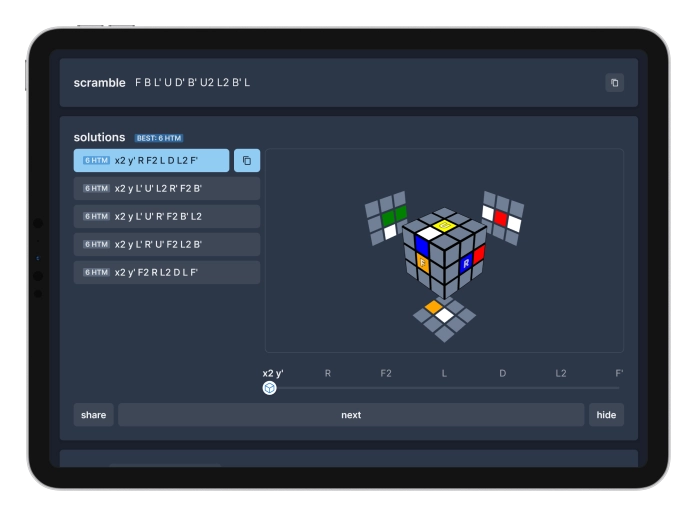

# crystalcube

A collection of unique speedcubing tools



## CFOP Cross & ZZ EO Trainers

Improves your first step efficiency: lets you learn from computer-optimal solutions with visualization

- Novel 3D cube visualizer highlights bad edges for EO and how they get eliminated
- Scrambles are random-state or can be set to a specific level
- Fast solver that generates optimal solutions for cross, EO, EOLine, EOCross
- Inspired by [Onionhoney's Roux Trainers](https://onionhoney.github.io/roux-trainers/)

## OH Scrambler

Generates fair scrambles that are easy to do one-handed

- `<R, U, F, L, D, B>` moves are translated to `<R, U, F, r, u f>`
- Supports both conventions for wide moves (Rw, r)
- Modes for left or right hand

## Cube solver library

The trainer is powered by `crystalcube`'s own cube library with some functionality from [`cubing.js`](https://github.com/cubing/cubing.js). It's focused on generating solutions for the first step of ZZ and CFOP, and can also solve first steps of any method you define!

- This library is still being developed and doesn't have documentation yet, and it could be replaced by cubing.js in the future

---

## Development

Make sure you have Node.js 19 or later installed!

Install the dependencies:

```bash
yarn install
```

Run `crystalcube` locally:

```bash
yarn dev
```

## Acknowledgements

Thanks to **[Contributors](https://github.com/ericx20/crystalcube/graphs/contributors)**!

**Zhouheng (Jeffrey) Sun**

- Created [Onionhoney's Roux Trainers](https://onionhoney.github.io/roux-trainers/), which inspired the concept, UI and functionality of `crystalcube`'s trainer
- Published a [interactive tutorial](https://observablehq.com/@onionhoney/how-to-model-a-rubiks-cube) for building a Rubik's Cube solver, which laid the foundation of `crystalcube`'s cube library

**Lucas Garron**

- Created [cubing.js](https://github.com/cubing/cubing.js), a comprehensive set of cube libraries that `crystalcube` uses
- Helped me get started with `cubing.js` and resolve issues with build tools

**S1neWav\_**

- Encouraged me to start the ZZ Trainer project
- Supports `crystalcube`

**Testers:** provided lots of suggestions

- [S1neWav\_](https://www.youtube.com/@S1neWav_)
- [Ryan Hudgens](https://www.youtube.com/@OreKehStrah)
- [Gen The Snail](https://www.youtube.com/@GenTheSnail)
- [yoruba 7](https://www.youtube.com/@yoruba7807)

## License

This software is released under MPL-2.0

The `crystalcube` logo is licensed under a <a rel="license" href="http://creativecommons.org/licenses/by/4.0/">Creative Commons Attribution 4.0 International License</a>

---

Made with ❤️ by crystalcuber

If you need help or have suggestions, please open a GitHub issue or DM me on Discord: `crystalcuber`
